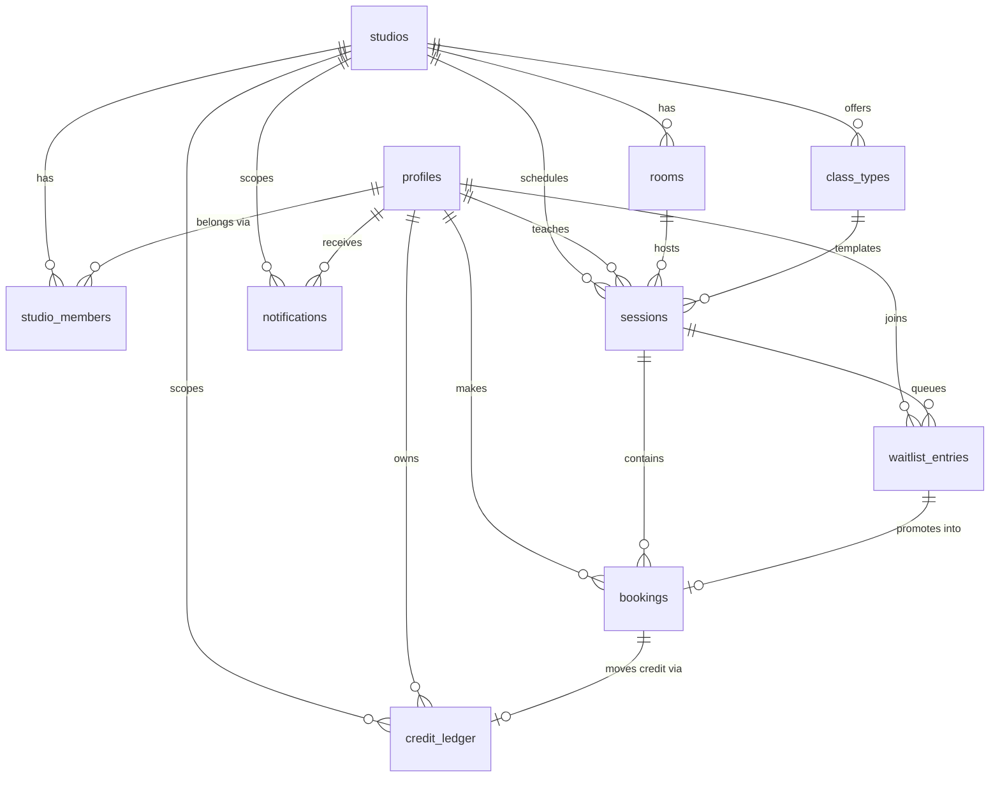

# Technical Architecture Document
## StudioFlow — Class Booking & Waitlist Management

**Course:** Internet Technologies — Become a Full-Stack Engineer, RUNI CS 2026
**Document:** Deliverable 4 of 10 — Technical Architecture
**Version:** 1.0
**Status:** Draft for review
**Depends on:** Product Specification v1.0 (approved)

---

## 0. Purpose and Scope of This Document

This document describes **what the system is made of and why it is arranged that way**. It defines components, entities, routes, data flow, the permission model, and the external dependencies.

It deliberately stops short of column-level schema, function signatures, component trees and error taxonomies. Those belong to the Detailed Technical Design (Deliverable 5). The dividing line used throughout: *architecture answers "why is it shaped like this"; design answers "exactly how is it built".*

### 0.1 Architectural principles

Six principles govern every decision below. Where a later decision looks unusual, it is almost always traceable to one of these.

1. **The database is the last line of defence, not the first.** Every access rule is enforced by Row Level Security in Postgres. Application-layer checks exist for user experience and early failure, never as the sole protection.
2. **Invariants that must never break are enforced by the database.** Capacity limits and duplicate-booking prevention are implemented with locking and constraints inside Postgres, not with read-then-write logic in TypeScript.
3. **Server by default.** Data is fetched in React Server Components. Client components are introduced only where interactivity genuinely requires them.
4. **Mutations go through one door.** All writes pass through Server Actions, which form a single, auditable trust boundary where authentication, validation and authorisation are applied in a consistent order.
5. **External I/O never happens inside a database transaction.** Emails are queued as rows and dispatched separately, so a failing mail provider can never roll back a booking.
6. **Money-adjacent state is append-only.** Credits are a ledger. Balances are derived, never edited in place.

---

## 1. System Components

### 1.1 Component overview

```
┌──────────────────────────────────────────────────────────────────┐
│  BROWSER                                                         │
│  React Server Component output + selective Client Components     │
│  Holds: UI state only (form input, modals, optimistic flags)     │
└───────────────┬──────────────────────────────────────────────────┘
                │ HTTPS · session cookie
                ▼
┌──────────────────────────────────────────────────────────────────┐
│  VERCEL — Next.js App Router (TypeScript)                        │
│                                                                  │
│  ┌────────────────┐  Middleware — refreshes Supabase session,    │
│  │  Middleware    │  performs coarse route gating                │
│  └────────────────┘                                              │
│  ┌────────────────┐  RSC — all page data reads, executed on      │
│  │  Server         │  the server with the user's own session     │
│  │  Components     │                                             │
│  └────────────────┘                                              │
│  ┌────────────────┐  Server Actions — every mutation.            │
│  │  Server Actions │  authn → validate → authz → execute →       │
│  └────────────────┘  revalidate                                  │
│  ┌────────────────┐  Route Handlers — cron endpoints only        │
│  │  Route Handlers │  (scheduled jobs, no user-facing API)       │
│  └────────────────┘                                              │
└───────┬────────────────────────────────────────┬─────────────────┘
        │ postgrest / rpc  (user session, RLS on)│ service role
        ▼                                        ▼  (RLS bypassed,
┌──────────────────────────────────────────────────  cron only)
│  SUPABASE                                                        │
│  ┌──────────────┐ ┌──────────────┐ ┌─────────────────────────┐   │
│  │ Auth         │ │ PostgreSQL   │ │ Postgres Functions      │   │
│  │ (GoTrue)     │ │ + RLS on all │ │ book_session()          │   │
│  │ email/pass   │ │ tables       │ │ cancel_booking()        │   │
│  └──────────────┘ └──────────────┘ │ promote_from_waitlist() │   │
│                                     └─────────────────────────┘   │
└──────────────────────────────────────────────────────────────────┘
        │
        ▼ (dispatched by cron, reading the notification outbox)
┌──────────────────────────────────────────────────────────────────┐
│  RESEND — transactional email                                    │
└──────────────────────────────────────────────────────────────────┘
```

### 1.2 The Next.js layer

**Middleware** runs on every matched request. Its single essential job is refreshing the Supabase session cookie, because Server Components cannot write cookies and would otherwise operate with an expired token. It additionally performs coarse gating — an unauthenticated request to any `/admin` path is redirected to login without a database round trip. Middleware is explicitly *not* the authorisation mechanism; it is an optimisation that avoids rendering pages that will fail anyway.

**Server Components** perform all page-level reads. They construct a Supabase client bound to the requesting user's session, so every query they issue is filtered by Row Level Security. A Server Component asking for "all bookings" receives only the bookings the user is permitted to see, without writing a single `WHERE user_id = ...` clause. This is a meaningful safety property: the common bug where a developer forgets an ownership filter cannot produce a data leak.

**Client Components** are used where interaction demands it — the booking button with its optimistic state, form inputs, the attendance roster toggles, date pickers, dialogs. They receive data as props from their server parents and call Server Actions to mutate.

**Server Actions** are the sole write path. Each follows a fixed sequence, described in §4.2. Grouping all mutations behind one pattern means the security review of this application is a review of the action files, not of the entire codebase.

**Route Handlers** exist only for scheduled jobs, which have no user session and are invoked by machines rather than browsers. There is no public REST API in v1, because there is no second client to consume it. Adding one would mean building and securing an interface with no user.

### 1.3 The Supabase layer

**Auth (GoTrue)** provides email/password authentication and issues JWTs. The JWT carries the user's identifier, which Postgres reads via `auth.uid()` inside every RLS policy. Supabase Auth is mandated by the course stack; it also removes the need to implement password hashing, reset flows and session rotation.

**PostgreSQL** is the system of record. Row Level Security is enabled on every application table with a deny-by-default posture.

**Postgres functions** hold the operations that must be atomic. Three carry the system's correctness:

- `book_session` — locks the session row, re-checks capacity, credit balance and duplicate state, then inserts the booking and the credit deduction together.
- `cancel_booking` — cancels, decides refund eligibility from the policy window, and attempts waitlist promotion, all in one transaction.
- `promote_from_waitlist` — selects the earliest eligible waitlist entry, converts it, deducts credit, and queues the notification.

Placing these in the database rather than in TypeScript is the single most consequential decision in this architecture, and §4.4 explains why the alternative is not merely slower but incorrect.

### 1.4 Three Supabase clients, three trust levels

This distinction is the backbone of the security model and is worth stating precisely.

| Client | Key used | RLS | Where it runs | Used for |
|---|---|---|---|---|
| **Browser client** | Anon (public) | Enforced | Browser | Auth calls (login, register, logout) only |
| **Server client** | Anon + user's session cookie | Enforced | RSC, Server Actions | All normal reads and writes — the default |
| **Service client** | Service role (secret) | **Bypassed** | Cron Route Handlers only | Scheduled jobs acting on all studios |

The anon key is public by design; it grants nothing on its own because RLS grants nothing on its own. The service role key bypasses RLS entirely and is therefore confined to a small number of files that never handle a user request. It is stored as a Vercel environment variable that is never prefixed `NEXT_PUBLIC_`.

### 1.5 Scheduled jobs

Three background jobs are required by the specification:

| Job | Frequency | Purpose | Spec reference |
|---|---|---|---|
| Notification dispatch | Every 5 minutes | Read unsent rows from the notification outbox, send via Resend, mark sent | C27 |
| Attendance finalisation | Hourly | Resolve unmarked bookings past the marking window to `attended` | BR-12 |
| Credit expiry | Nightly | Write compensating ledger entries for expired unused credits | BR-13 |

**Primary mechanism:** Vercel Cron invoking protected Route Handlers.
**Identified risk:** Vercel's hobby tier restricts cron frequency, which may make five-minute dispatch unavailable on the free plan.
**Fallback:** Supabase `pg_cron`, which is available in-database and can invoke the same logic directly. Because the promotion and expiry logic already lives in Postgres functions, moving the scheduler costs almost nothing — the job bodies do not change. This portability is a deliberate consequence of principle 2.

---

## 2. Database Entities

### 2.1 Entity relationship overview



### 2.2 Core entities

**`profiles`** — one row per authenticated person, keyed to the Supabase `auth.users` identifier. Holds display name, email and phone. Application code never reads the `auth` schema directly; `profiles` is the public projection.

*Why a separate table:* `auth.users` is managed by Supabase and is not a safe place for application columns or for foreign keys from application tables.

**`studios`** — the tenant. Holds studio name, timezone, and the policy parameters from the Business Rules table: cancellation window hours (BR-1), promotion cutoff hours (BR-3), and the default attendance resolution (BR-12).

*Why the policy lives here rather than in code:* the specification defines these as configurable per studio. Storing them as data means the Postgres functions that enforce them read the studio's own values, and a policy change requires no deployment.

**`studio_members`** — the join between a person and a studio, carrying the role: `student`, `instructor` or `admin`. This table is the **single source of truth for authorisation**.

*Why a join table rather than a role column on `profiles`:* it makes the multi-tenant boundary explicit, and it allows one person to hold different roles in different studios — the natural case of an instructor who teaches at one studio and takes classes at another. The v1 user interface does not expose studio switching, but the schema does not have to be rewritten to add it.

**`rooms`** — name and mat capacity. Sessions default their capacity from the room, which supports success criterion 1 (fast setup).

**`class_types`** — name, description, duration in minutes. The template from which sessions are created.

**`sessions`** — the bookable unit, and the busiest table in the system. Holds studio, class type, room, instructor, start time in UTC, duration, capacity, and status (`scheduled` or `cancelled`).

*Note on `capacity`:* it is copied onto the session rather than read through the room at booking time. A room's capacity may change; sessions already booked under the old capacity must not silently change size.

**`bookings`** — a student's seat in a session. Carries two orthogonal state fields:

- `status` — `confirmed` or `cancelled`, describing the booking's existence
- `attendance` — `null`, `attended` or `absent`, describing what happened

*Why two fields rather than one status enum:* collapsing them produces impossible-to-answer questions such as "was this cancelled booking also a no-show." Keeping them separate makes every reporting query in §5 of the specification expressible without special cases. Also recorded: cancellation timestamp, whether the credit was refunded, and whether the booking originated from a waitlist promotion — the last of these is what makes waitlist conversion rate (G1) measurable.

**`waitlist_entries`** — a queued claim. Holds session, student, join timestamp, and status (`waiting`, `promoted`, `left`).

*Why position is not stored:* a stored position must be renumbered every time anyone leaves, which is both a write amplification problem and a source of gaps and duplicates under concurrency. Position is derived at read time by ordering on join timestamp. Storing it would be a denormalisation with no benefit at this scale.

**`credit_ledger`** — append-only record of every credit movement. Each row carries the student, the studio, a signed delta, an entry type (`grant`, `booking`, `refund`, `expiry`, `adjustment`), an optional link to the booking or session that caused it, an expiry date for grants, a free-text note, and who created it.

*Balance is the sum of the ledger.* No mutable balance column exists in v1. At the specification's scale — a few hundred rows per student per year — a summed aggregate over an indexed column is fast and always correct. A cached balance would be faster and occasionally wrong, which is the wrong trade for a value students will dispute.

*Expiry handling (BR-13):* rather than filtering expired grants at read time, which makes the balance a complicated query, a nightly job writes a compensating negative `expiry` entry when a grant expires with unused credits. The balance stays a plain sum, and the ledger shows the student exactly what happened and when.

**`notifications`** — dual purpose, and this is intentional. Each row is simultaneously an item in the in-app notification centre (C26) and an outbox entry for email dispatch (C27). Holds recipient, type, payload, read timestamp, and email-sent timestamp.

*Why one table for both:* the in-app centre is the guaranteed channel identified in assumption A4. Writing the row is part of the promotion transaction and therefore cannot be lost. Email is a projection of that row, sent later by a job. If Resend is down, the notification still exists and the student still sees it on their next visit — the failure is degraded, not lost. This is the transactional outbox pattern, and it is what allows principle 5 to be honoured without sacrificing reliability.

### 2.3 Entity summary

| Entity | Purpose | Growth rate |
|---|---|---|
| `profiles` | Person identity | Low |
| `studios` | Tenant + policy | Fixed |
| `studio_members` | Role assignment | Low |
| `rooms` | Physical capacity | Fixed |
| `class_types` | Class templates | Fixed |
| `sessions` | Bookable instances | Moderate |
| `bookings` | Seats taken | **High** |
| `waitlist_entries` | Queued claims | Moderate |
| `credit_ledger` | Credit movements | **High** |
| `notifications` | In-app feed + email outbox | **High** |

The three high-growth tables drive the index strategy in the Scaling document.

---

## 3. Application Pages

Routes are organised with App Router route groups. Groups shape the folder structure and allow distinct layouts per audience without appearing in the URL.

### 3.1 Public

| Route | Purpose | Rendering |
|---|---|---|
| `/` | Studio landing page, current week preview | Server, cached |
| `/schedule` | Full upcoming schedule with live availability | Server, dynamic |
| `/schedule/[sessionId]` | Session detail — instructor, room, remaining seats | Server, dynamic |
| `/login` | Sign in | Client form |
| `/register` | Create account | Client form |
| `/auth/callback` | Session establishment | Route Handler |

The schedule is public and requires no account. This directly serves Flow 1: requiring registration before a student can see whether the studio offers a class at a time they can attend suppresses conversion for no benefit.

### 3.2 Student

| Route | Purpose |
|---|---|
| `/my/bookings` | Upcoming bookings, waitlist entries with position, cancel action |
| `/my/history` | Past bookings with attendance outcome |
| `/my/credits` | Current balance, full ledger history, expiry warnings |
| `/my/notifications` | In-app notification centre |
| `/my/profile` | Name, phone, password change |

### 3.3 Instructor

| Route | Purpose |
|---|---|
| `/teach` | Upcoming sessions taught by this instructor |
| `/teach/[sessionId]` | Roster, attendance marking, waitlist view, session cancellation |

Deliberately minimal. The instructor role has one job in the product and should not be given a navigation tree implying otherwise.

### 3.4 Admin

| Route | Purpose |
|---|---|
| `/admin` | Dashboard — today's sessions, fill rates, alerts |
| `/admin/schedule` | Week view, create and edit sessions |
| `/admin/schedule/new` | Single session or weekly repeat generation |
| `/admin/sessions/[id]` | Full session management, manual booking and removal |
| `/admin/students` | Student list with balances and last-attendance |
| `/admin/students/[id]` | Student detail, ledger, grant credits |
| `/admin/instructors` | Invite and manage instructors |
| `/admin/class-types` | Class type management |
| `/admin/rooms` | Room and capacity management |
| `/admin/settings` | Studio policy: cancellation window, promotion cutoff, timezone |
| `/admin/reports` | Fill rate, attendance, no-show, waitlist conversion, inactive students |

### 3.5 Route Handlers

| Route | Invoked by | Purpose |
|---|---|---|
| `/api/cron/dispatch-notifications` | Vercel Cron | Send queued emails |
| `/api/cron/finalize-attendance` | Vercel Cron | Apply BR-12 |
| `/api/cron/expire-credits` | Vercel Cron | Apply BR-13 |

Each verifies a shared secret in the request header before doing anything. Without that check these endpoints are publicly invocable, and the attendance job in particular mutates data.

### 3.6 Why Server Actions rather than API routes

The assignment asks which of the two the project needs. The answer for this system is: Server Actions for essentially everything, Route Handlers only for cron.

Route Handlers earn their place when there is a caller that is not this application's own UI — a mobile client, a third-party integration, a webhook sender. This project has none in v1; native mobile is explicitly out of scope and there is no payment provider to receive webhooks from.

Building a REST layer anyway would mean writing route files, request and response types, fetch wrappers, and client-side loading and error state for every mutation — and then securing all of it — to serve exactly one consumer that could have called the function directly. Server Actions remove that layer while keeping the trust boundary in one place. The cron endpoints are Route Handlers because a scheduler cannot invoke a Server Action.

---

## 4. Data Flow

### 4.1 Read path

```
Browser request
   → Middleware refreshes session cookie
   → Server Component creates Supabase client from cookies
   → Query issued to Postgres
   → RLS filters rows by auth.uid() and studio membership
   → Rows returned to the component
   → HTML streamed to browser
```

No JSON travels to the browser for page data, and no client-side fetch or loading spinner exists for initial render. Concretely, `/teach/[sessionId]` queries bookings for that session; the instructor RLS policy returns rows only if the requester teaches that session. The component contains no ownership check of its own, and cannot be made insecure by forgetting one.

### 4.2 Write path

Every Server Action executes the same five stages, in this order:

```
1. AUTHENTICATE   Resolve the user from the session. No session → reject.
2. VALIDATE       Parse raw input with a Zod schema. Malformed → reject
                  with field-level errors. Nothing unparsed proceeds.
3. AUTHORIZE      Confirm the caller's role permits this operation.
4. EXECUTE        Call a Postgres function, or perform a scoped write.
5. REVALIDATE     Invalidate affected route caches so the UI reflects truth.
```

Order matters. Validating before authorising means authorisation logic never receives unparsed input. Authorising before executing means invalid callers never reach the database. The database applies its own RLS regardless — stage 3 exists so failures produce useful messages rather than confusing empty results.

### 4.3 Worked example — a student books a seat

```
Client component: "Book" clicked, optimistic pending state
   ↓
Server Action bookSession(sessionId)
   ↓  1. resolve user from session cookie
   ↓  2. Zod: sessionId is a UUID
   ↓  3. caller is a member of this session's studio
   ↓  4. rpc('book_session', { session_id, student_id })
        ┌─────────────── inside one Postgres transaction ───────────┐
        │ lock the session row                                      │
        │ verify status = scheduled and start time is future (BR-8) │
        │ count confirmed bookings; verify below capacity (BR-5)    │
        │ verify no existing booking or waitlist entry (BR-6)       │
        │ sum credit ledger; verify balance ≥ 1 (BR-4)              │
        │ insert booking (confirmed)                                │
        │ insert ledger entry (−1, type 'booking')                  │
        │ COMMIT — or roll back entirely on any failure             │
        └───────────────────────────────────────────────────────────┘
   ↓  5. revalidate /schedule, /my/bookings, /my/credits
   ↓
Result returned; UI resolves to confirmed or shows the specific reason
```

### 4.4 Why the booking transaction lives in Postgres

This is the decision most likely to be probed in the presentation, so the reasoning is recorded here in full.

The natural TypeScript implementation reads the current booking count, compares it to capacity, and inserts if there is room. Between the read and the insert, another request can complete the identical sequence. Both observe thirteen of fourteen seats taken. Both insert. The room now holds fifteen bookings for fourteen mats — violating BR-5 and success criterion 3.

This is not a rare theoretical case. It is the *expected* case at exactly the moment it matters most: the last seat in a popular class, when several students are tapping simultaneously. The window is small, but Vercel runs concurrent serverless invocations, so two requests genuinely execute in parallel.

Three properties of the chosen approach:

- **Locking the session row serialises contenders.** The second transaction waits at the lock, and when it proceeds it observes the first transaction's insert. It then correctly fails the capacity check.
- **The check and the write share a transaction.** There is no window between deciding and acting.
- **Constraints provide defence in depth.** A partial unique index on confirmed bookings per session and student makes duplicate booking impossible even if the function's logic were wrong.

A secondary benefit follows from principle 2's placement: because the rule lives in the database, it holds for *every* caller — a Server Action, a cron job, or an administrator running SQL in the Supabase console. A rule enforced only in application code protects only the paths that remember to call it.

### 4.5 Cancellation and promotion flow

```
Server Action cancelBooking(bookingId)
   ↓  rpc('cancel_booking', ...)
        ┌────────────── one Postgres transaction ───────────────────┐
        │ lock session; verify caller owns this booking             │
        │ set booking status = cancelled                            │
        │ read studio's cancellation window (BR-1)                  │
        │ if outside window → ledger entry (+1, type 'refund')      │
        │ if inside promotion cutoff (BR-3) → stop here             │
        │ else select earliest waiting entry with balance ≥ 1 (BR-7)│
        │   convert entry to confirmed booking                      │
        │   ledger entry (−1, type 'booking')                       │
        │   insert notification row  ← outbox, not an email         │
        │ COMMIT                                                    │
        └───────────────────────────────────────────────────────────┘
   ↓  revalidate affected routes
   ↓
[ later, independently ]
Cron → /api/cron/dispatch-notifications
   ↓ service-role client reads unsent notifications
   ↓ Resend sends email
   ↓ mark email_sent_at
```

The separation in the final block is principle 5 in practice. If the email send were inside the transaction, a Resend outage or timeout would roll back a legitimate cancellation and promotion. Instead the transaction writes a row and commits; delivery is a separate concern with its own retry behaviour, and a failure there degrades the notification channel without touching the booking state.

---

## 5. Users and Permissions

### 5.1 Where roles live

`studio_members` is the source of truth. A role is a property of *a person within a studio*, not a global attribute of a person.

Access decisions are made in Postgres through small helper functions that answer questions such as "which studio is this user a member of", "is this user an admin of studio X", and "does this user teach session Y". Policies call these helpers rather than repeating subqueries.

**A trap worth recording explicitly:** an RLS policy on `studio_members` that itself queries `studio_members` recurses infinitely and fails at runtime. The helper functions are therefore defined as `SECURITY DEFINER`, which executes them with the definer's rights and breaks the recursion. This is a well-known Supabase pitfall and the reason the helper-function indirection exists at all — it is not stylistic.

### 5.2 Enforcement layers

Authorisation is applied at four points, each with a distinct job:

| Layer | Mechanism | Job | Sufficient alone? |
|---|---|---|---|
| Middleware | Cookie check, redirect | Avoid rendering doomed pages | No |
| Server Component | Role read from membership | Render the correct navigation and controls | No |
| Server Action | Explicit role assertion | Fail fast with a clear message | No |
| **Postgres RLS** | **Row-level policies** | **Actually prevent access** | **Yes** |

Only the last layer is load-bearing. The first three improve the experience and produce comprehensible errors. If all three were removed, no user could read or write data they are not entitled to; if only RLS were removed, all three of the others could be bypassed by any authenticated user issuing a direct PostgREST request with the public anon key.

### 5.3 Policy model per table

Every table is RLS-enabled with no permissive default. Access is granted by explicit policy only.

| Table | Student | Instructor | Admin |
|---|---|---|---|
| `sessions` | Read all in studio | Read all; update own taught sessions | Full |
| `bookings` | Read/write own only | Read for own taught sessions; update attendance | Full within studio |
| `waitlist_entries` | Read/write own only | Read for own taught sessions | Full within studio |
| `credit_ledger` | **Read own only, no write** | Read own only | Read all in studio; insert grants |
| `profiles` | Read own; read name of instructors | Read own; read names on own rosters | Read all in studio |
| `studios` | Read own studio | Read own studio | Read and update own studio |
| `studio_members` | Read own row | Read own row | Full within studio |
| `notifications` | Read own; mark own read | Read own | Read own |
| `rooms`, `class_types` | Read | Read | Full |

Two entries deserve comment.

**Students cannot write to `credit_ledger` under any policy.** Credits are the product's unit of value. All ledger writes occur inside `SECURITY DEFINER` functions that the student may invoke but not circumvent — a student can *cause* a deduction by booking, and can never author a ledger row directly. Granting insert rights to students, even narrowly, would make the balance forgeable.

**Instructors see rosters, not people.** The `profiles` policy exposes only the names of students booked into sessions the instructor teaches. An instructor cannot enumerate the studio's membership, and cannot read a student's phone, email or credit balance. This satisfies the specification's explicit statement that instructors have no access to financial data.

### 5.4 Multi-tenant isolation

Every studio-scoped table carries a studio identifier, and every policy constrains it to studios the requester belongs to. This is the enforcement mechanism behind success criterion 7. It is written now, while there is one studio, because retrofitting tenant isolation onto a system that assumed a single tenant is a rewrite rather than an addition — and because it is testable now: create two studios, attempt cross-reads, assert zero rows.

---

## 6. External Libraries and Services

The assignment requires justification for each dependency. Each entry states what it does, why it is needed, and what the alternative would have cost.

### 6.1 Platform (mandated by the course)

| Dependency | Role | Justification |
|---|---|---|
| **Next.js (App Router)** | Framework | Required. Server Components remove the client data-fetching layer; Server Actions provide a typed mutation boundary without a REST API. |
| **TypeScript** | Language | Required. Compile-time safety across the RSC/Client/Action boundary, where a runtime shape error is otherwise hard to trace. Types are generated from the Supabase schema, so a column rename becomes a build failure rather than a production defect. |
| **Supabase** | Postgres, Auth, RLS | Required. Provides the RLS mechanism the entire permission model rests on, plus managed authentication. |
| **Vercel** | Hosting, Cron | Required. Native Next.js deployment; Cron provides the scheduler for §1.5. |

### 6.2 Data and validation

| Dependency | Role | Justification |
|---|---|---|
| **`@supabase/supabase-js`** | Database and auth client | Official client. Typed against generated schema types. |
| **`@supabase/ssr`** | Cookie-based session handling | The Server Component model requires reading the session from cookies on the server and refreshing it in middleware. This package implements that correctly; hand-rolling it means reimplementing token refresh and cookie chunking, which is a source of subtle logout bugs. |
| **`zod`** | Runtime input validation | **TypeScript types do not exist at runtime.** A Server Action receives whatever the network delivers, and the browser is not a trusted source. Zod is the enforcement of stage 2 in §4.2 — it converts unknown input into a typed value or rejects it. Its schemas also generate the field-level errors the forms display, so validation is defined once and used in both places. |

### 6.3 Interface

| Dependency | Role | Justification |
|---|---|---|
| **Tailwind CSS** | Styling | Utility classes keep styling adjacent to markup, which suits a component-per-file structure. Avoids a parallel stylesheet hierarchy that drifts from the components it styles. |
| **shadcn/ui** (Radix primitives) | Accessible components | Dialogs, dropdowns, date pickers and toasts with keyboard navigation and focus management already correct. Components are copied into the repository rather than installed, so they are readable, modifiable and explainable — which matters for the assignment's requirement to understand every part of the code. Building an accessible dialog by hand is a genuine time sink with no learning payoff here. |
| **`react-hook-form`** | Form state | Uncontrolled inputs avoid re-rendering the form on every keystroke. Integrates with Zod through a resolver, so the same schema validates on client and server. |
| **`lucide-react`** | Icons | Tree-shakeable SVG icon set. |

### 6.4 Time

| Dependency | Role | Justification |
|---|---|---|
| **`date-fns` + `date-fns-tz`** | Date arithmetic and timezone conversion | The most defect-prone area of this domain. Sessions are stored in UTC (BR-14) and displayed in `Asia/Jerusalem`, which observes daylight saving. Every policy calculation — is this cancellation inside the twelve-hour window, is this promotion inside the two-hour cutoff — is a comparison across that boundary. Native `Date` has no timezone support beyond the host's local zone, which on Vercel is UTC and on the student's laptop is not; that mismatch produces bugs that appear only in production. `date-fns-tz` makes the conversion explicit. Chosen over Luxon for tree-shaking and over Moment because Moment is in maintenance mode. |

### 6.5 Email

| Dependency | Role | Justification |
|---|---|---|
| **Resend** | Transactional email | Required for C27. Simple API, generous free tier, React-based templates. Consumed only by the dispatch job, so the dependency touches one file. **Risk:** sending from an unverified domain harms deliverability; the mitigation is that email is never the sole channel (assumption A4). |

### 6.6 Testing

| Dependency | Role | Justification |
|---|---|---|
| **Vitest** | Unit and integration tests | Native TypeScript and ESM support, fast watch mode. Used for business-rule logic — window calculations, promotion eligibility, balance derivation. |
| **React Testing Library** | Component tests | Tests behaviour through the accessibility tree rather than implementation detail, so refactors do not break tests spuriously. |
| **Playwright** | End-to-end tests | Required for the flows that only exist across pages: register → book → cancel → promote. **Critically, it is also the tool that proves success criterion 3** — parallel workers can issue simultaneous booking requests for a single remaining seat, which is the only realistic way to demonstrate that §4.4 works. |

### 6.7 Deliberately not used

Recording rejected options is part of the assignment's requirement to justify technical decisions.

| Not used | Reason |
|---|---|
| **Prisma / Drizzle** | An ORM connects with database credentials and therefore **bypasses RLS**, which is the foundation of the entire permission model. Using one would mean reimplementing every access rule in TypeScript and losing the guarantee that a forgotten filter cannot leak data. The Supabase client speaks PostgREST as the authenticated user, so RLS applies. |
| **Redux / Zustand** | Server state lives on the server and arrives through RSC. What remains is local UI state, which `useState` handles. A global store here would be an elaborate cache of data the framework already caches. |
| **NextAuth / Auth.js** | Supabase Auth is mandated, and it is also the only option that populates `auth.uid()` inside RLS policies. A second auth system would leave the database unable to identify the user. |
| **tRPC** | Solves typed client–server communication. Server Actions already provide it within Next.js, with less machinery. |
| **A separate REST API** | See §3.6 — no second consumer exists in v1. |
| **Stripe** | Online payment is out of scope per specification §8. |
| **Redis / caching layer** | Next.js request and route caching is sufficient at the specified scale. Introducing a cache before measuring a problem adds an invalidation surface with no demonstrated benefit. |

---

## 7. Environment Variables

| Variable | Scope | Purpose |
|---|---|---|
| `NEXT_PUBLIC_SUPABASE_URL` | Public | Project endpoint |
| `NEXT_PUBLIC_SUPABASE_ANON_KEY` | Public | Anonymous key; safe to expose because RLS grants nothing without a policy |
| `SUPABASE_SERVICE_ROLE_KEY` | **Secret** | Bypasses RLS; cron jobs only; never referenced in client-reachable code |
| `RESEND_API_KEY` | **Secret** | Email dispatch |
| `CRON_SECRET` | **Secret** | Shared secret authenticating cron invocations |
| `NEXT_PUBLIC_SITE_URL` | Public | Absolute URLs in email templates |

The `NEXT_PUBLIC_` prefix is the mechanism that determines whether a value reaches the browser bundle. Secrets omit it. This is expanded in the Security document.

---

## 8. Open Questions for Step 4

Carried forward to the Detailed Technical Design:

1. **Weekly repeat generation limit** — a maximum number of weeks per operation, to bound the transaction size. Proposed: 12.
2. **Notification retry policy** — attempt count and backoff before a queued email is abandoned.
3. **Instructor invitation mechanism** — Supabase invite email versus an admin-created account with a temporary password.
4. **Report query strategy** — computed on demand versus materialised. Proposed: on demand for v1, with the decision recorded in the Scaling document.

---

*End of document — awaiting review before proceeding to the Detailed Technical Design.*
